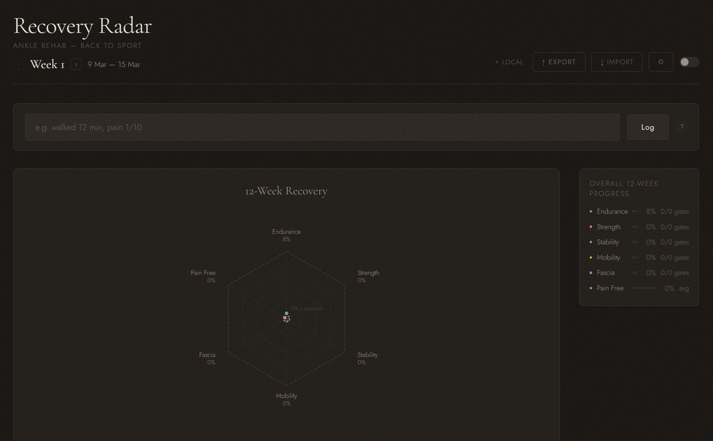
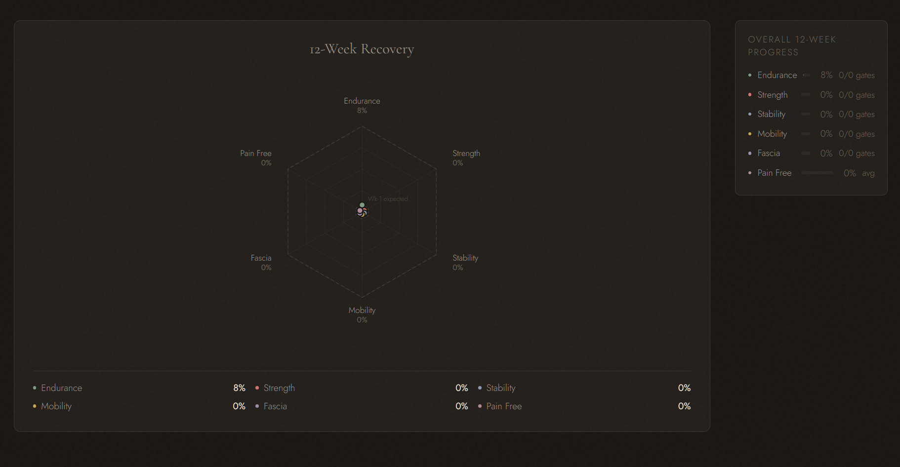
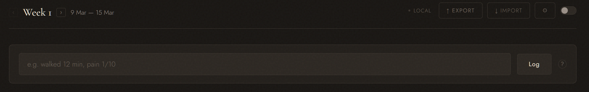
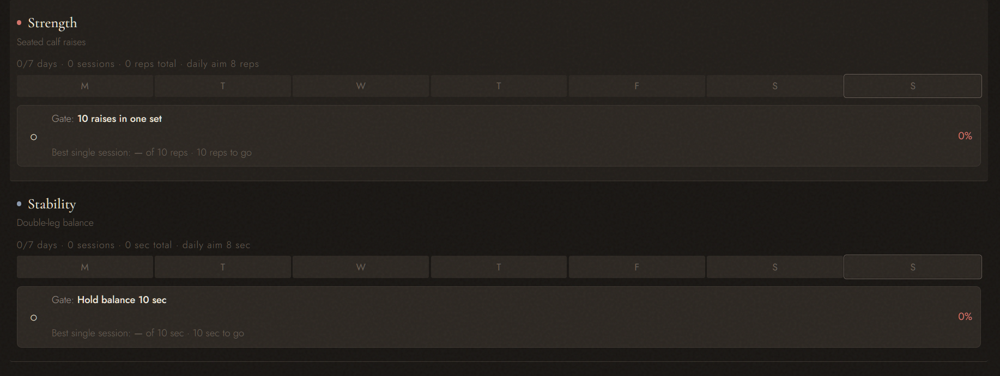
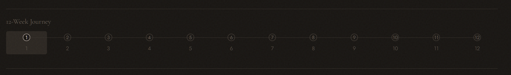
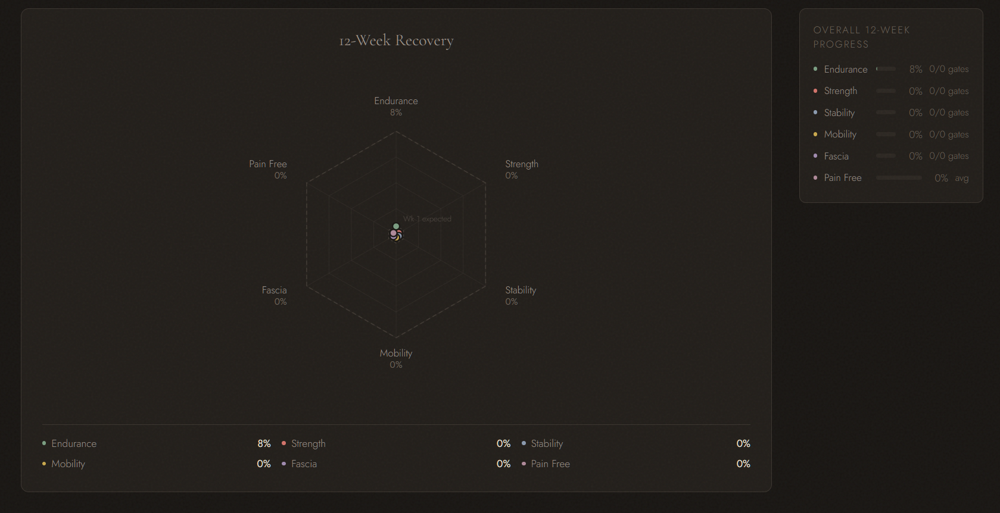
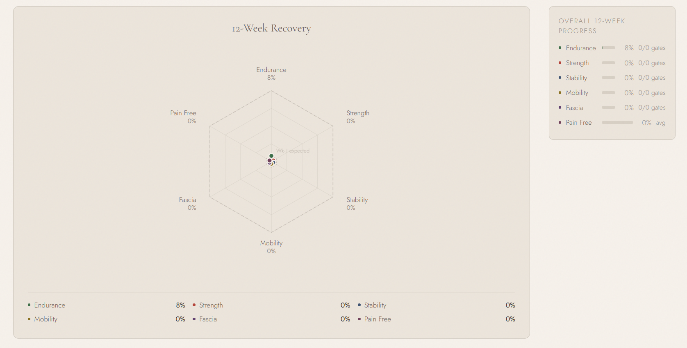
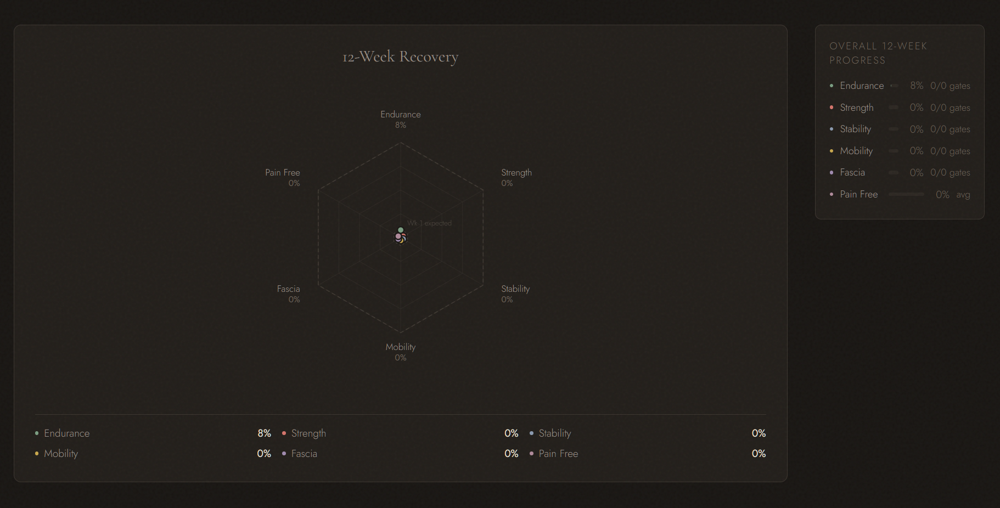
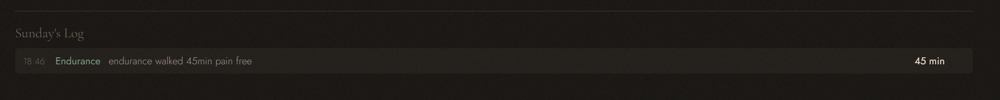
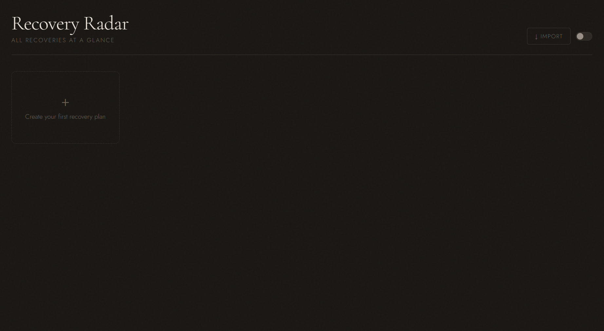

# Recovery Radar

**The whole picture.**

A single-file visual rehab tracker for injury recovery. No database. No framework. No backend required. One HTML file. Open it. Start recovering.

Built with ADHD in mind. Vibe coded with Claude.



---

## The Six Axes

This is the core of Recovery Radar.

Every injury recovery, regardless of body part, comes down to the same six dimensions. They form the radar chart at the centre of the dashboard. The filled shape is where you are. The dashed outline is where you should be. When one axis lags behind the others, you see it instantly.



| Axis | What it tracks | Measured in |
|:---|:---|:---|
| **Endurance** | Sustained effort over time. Walking, jogging, running, sport-specific cardio. | Minutes continuous |
| **Strength** | Force production through the injured area. Raises, weighted work, plyometrics. | Reps in one set |
| **Stability** | Joint control under load. Balance, board work, agility, cutting. | Seconds held |
| **Mobility** | Full range of motion. Circles, stretches, ROM work. | Quality 1 to 5 |
| **Fascia** | Connective tissue recovery. Foam rolling, ball work, myofascial release. | Minutes continuous |
| **Pain Free** | Pain trend over time. Reported per session, averaged across logs. | Inverted /10 scale |

Symmetric shape = balanced recovery. Asymmetric shape = something needs attention. No numbers required. One look.

---

## Natural Language Logging

No dropdowns. No forms. No tapping through five screens.

One text input. Type like you talk. Hit Enter.



```
walked 12 min pain 1/10       →  Endurance · 12 min · pain 1/10
calf raises 8 reps             →  Strength · 8 reps
balance board 45 sec            →  Stability · 45 sec
ankle circles quality 4         →  Mobility · quality 4/5
foam rolled 10 min              →  Fascia · 10 min
strength 75%                    →  Strength · 75% of weekly gate target
jogged 5 min pain 0/10         →  Endurance · 5 min · pain free
```

The parser detects the pillar from keywords, extracts the numeric value and unit, and picks up pain if mentioned. Pain is on a /10 scale. Writing /5 auto-converts. No pain mentioned = nothing assumed.

Log as many times per day as you want. Every session counts.

---

## The Dual Layer System

This took a few iterations to get right. It matters.



### Training Bar

Seven day segments. One per day. Fills every time you log. Multiple sessions per day stack within the same segment. Today is outlined.

This is your **effort**. Walk 5 minutes on Monday, Monday fills. Walk 10 minutes on Tuesday, Tuesday fills more. It moves every single time you do something. The bar rewards showing up.

### Gate Card

Separate indicator below the training bar. Shows your best single session against the weekly capability target.

This is your **capability**. "Walk 15 min pain-free" means: in one session. Not accumulated. Walking 5 minutes six times does not mean you can walk 15 minutes continuous. The gate only moves when you beat your personal best for the week.

### Why both

If only the gate moves the bar, you train for four days and see zero visual progress. Motivation dies. The brain skips the gradual ramp and tries the full target immediately. That is how re-injury happens.

If only accumulated volume counts, you never test actual capability. The gate becomes meaningless.

Both layers visible. Both matter. The training bar says *the work is happening*. The gate says *the capability is building*.

---

## Adaptive Goals

When a week ends, the system evaluates each pillar independently.

| Gate result | Next week |
|:---|:---|
| **Passed** (100%+) | Loads as planned |
| **Partial** (50 to 99%) | Targets interpolate downward proportionally |
| **Failed** (below 50%) | That pillar repeats the current week's goals |

Each pillar adapts on its own. You can be on track for endurance but repeating stability. Adapted weeks show a ⟳ marker in the timeline. No manual intervention required.

---

## Timeline



Horizontal spine at the bottom. Each week is a node. Completed weeks show coloured dots per pillar: passed, partial, or missed. Current week highlighted. Click any week to review.

The radar chart shows the full journey shape, not just the current week. A smaller dashed polygon marks the expected position for your current week. Ahead, behind, or balanced: one glance.

---

## Screenshots

> Replace these with actual screenshots after first use.

| View | Screenshot |
|:---|:---|
| Dark mode, full dashboard |  |
| Light mode, full dashboard |  |
| Radar chart, mid-recovery |  |
| Log feedback after entry |  |
---

## Getting Started

No installation. No build step.

**Generic version (multiple plans, fully configurable):**

1. Download `recovery-radar.html`
2. Open in any browser
3. Click **+** to create a recovery plan: set a title, number of weeks, and weekly goals per pillar
4. Create as many plans as you need. Shoulder and knee side by side. Each runs simultaneously on its own dashboard.

**Ankle recovery (pre-configured 12-week plan):**

1. Download `recovery-radar-ankle.html`
2. Open in any browser
3. Click **⚙** to set your rehab start date and optional NAS URL
4. Start logging

---

## Plan Library

The generic version opens to a library view showing all your active recovery plans as cards. Each card displays:

- Plan title and current week
- Gates passed across all pillars
- A mini radar chart showing the recovery shape at a glance



Click a card to enter its full dashboard. Click **← All Plans** to return. Create as many simultaneous plans as you need. Each plan has its own logs, its own week counter, its own adaptive goals. They never interfere with each other.

---

## Synology NAS Sync

For multi-device use. Same pattern as [Project Eidos](https://github.com/twishav/project-eidos).

### Requirements

Synology NAS with **Web Station** enabled and PHP support.

### Setup

1. Create `/web/recovery-radar/` on your NAS
2. Upload `recovery-radar.html` and `api.php` into that folder
3. In DSM, open **Web Station** and ensure PHP is enabled (not "Static website only")
4. **File Station** → right-click the folder → **Properties** → **Permission** → `http` user needs **Read & Write**
5. Tick **"Apply to this folder, sub-folders and files"** → Save
6. Verify: `http://YOUR-NAS-IP/recovery-radar/api.php` should return `{"lastModified":0,"data":null}`
7. Open the HTML on any device, click **⚙**, enter the NAS URL, Save

The NAS URL is stored only in `localStorage`. Never in source code. Safe to push to GitHub.

### Sync behaviour

The app pings the NAS on load. If reachable, it compares timestamps and pulls the newer version. If unreachable, it falls back to `localStorage` and labels the connection as "Offline." A background watcher re-checks every 15 seconds and syncs silently when the connection returns.

---

## Data and Storage

Everything in `localStorage`. Nothing leaves the browser unless you export or sync.

| Key | Contents |
|:---|:---|
| `rr_idx` | Index of all plan IDs (generic version) |
| `rr_p_{id}` | Individual plan data (generic version) |
| `rr6` | All state (ankle version) |
| `rr_t` | Theme preference |
| `rr_nas` | NAS URL (per device) |
| `rr_ts` | Last save timestamp (for sync) |

Log entry structure:

```json
{
  "id": "m3x7k...",
  "ts": 1710500000000,
  "w": 3,
  "p": "endurance",
  "desc": "walked 12 min",
  "v": 12,
  "u": "min",
  "pn": 1
}
```

---

## Pre-built Plan: Ankle Recovery

The `recovery-radar-ankle.html` file comes with an embedded 12-week plan progressing from basic walking and seated exercises to full sport-specific drills. The generic `recovery-radar.html` lets you build your own from scratch.

| Pillar | Week 1 | Week 6 | Week 12 |
|:---|:---|:---|:---|
| Endurance | Walk 5 to 10 min | Jog + rollerblade | Football drills |
| Strength | Seated calf raises | 20 raises per set | Sport strength |
| Stability | Double-leg balance | Board with turns | Game movement |
| Mobility | Small ankle circles | Dynamic stretches | Full ROM |
| Fascia | Gentle rolling 3 min | Deep tissue 15 min | Sport recovery |

**Target sports:** Football, jump rope, rollerblading, surfskating, surfing.

---

## Design

**Typefaces.** Cormorant Garamond for headings. Jost for interface text. Same family as Project Eidos.

**Colour palette.** Renoir-inspired muted tones. Distinct hue per pillar: sage for endurance, coral for strength, slate for stability, amber for mobility, mauve for fascia, rose for pain. Separate palettes for dark and light mode.

**Grain texture.** Subtle film grain across the surface. Enough to remove the sterile digital feel.

**No notifications. No badges. No urgency theatre.** The dashboard is calm. You open it when you want to.

---

## Roadmap

| Status | Feature |
|:---|:---|
| Done | Custom recovery week count |
| Done | User-editable recovery schedule |
| Done | Multiple simultaneous recovery plans with separate dashboards |
| Done | NAS sync (Synology) |
| Planned | Support for different injury types (knee, shoulder, wrist) with pre-built plans |
| Planned | AI-assisted recovery scheduling: describe your injury and targets, get a generated plan |
| Planned | TV display mode for physio spaces |
| Planned | Keyboard shortcuts for rapid logging |

---

## Vibe Coded

This project was vibe coded with [Claude](https://claude.ai). 

---

## Files

| File | Purpose |
|:---|:---|
| `recovery-radar.html` | The app (generic, user-configurable plan) |
| `recovery-radar-ankle.html` | Pre-configured 12-week ankle recovery plan |
| `api.php` | NAS backend for multi-device sync |
| `README.md` | This file |

---

## License

MIT. Do whatever you want with it.
